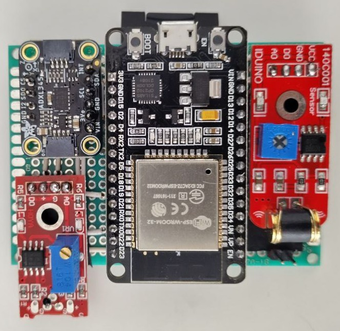

## Hardware

For the [schematic see](schematic/schematic.pdf). Created with [KiCad](https://www.kicad.org/).

## Flashing the microcontroller

The software is written as a Project for the Arduino IDE - but the IDE wasn't used itself. For compilation and upload the `arduino-cli` tools were used. The necessary parameters are wrapped together into three bash-scripts (see `/src/*.sh`). Before using the Scripts, the ESP32 needs to be [added to the board-manager](https://docs.espressif.com/projects/arduino-esp32/en/latest/installing.html) of the Arduino-IDE-GUI. You can check if the correct board is present with `arduino-cli board listall | grep esp32doit`. Otherwise, no external libraries were used.

## General settings in the software

The system-clock of the ESP32-Microcontroller is reduced to save some power. Decreasing it's operating frequency from 80MHz down to 40MHz saves around 40mA. Because our application does not make use of the modules for wireless communications, the wifi and bluetooth modules are shut down as well. This also frees up the second Analog-to-Digital-Converter on the µC-Processor-Board.

The blue LED on the µC-Board indicates activity on the SD card except for pure-writing. Time-intensive processes are opening and closing files as well as the periodic flushes that are triggered by one of the control loops every second. This ensures, that only the data written to the SD-Card since the last flush is lost.

## Data Processing flow
The sensor is aquired with a frequency of 200Hz. A 5ms-raster is used to accomplish that. Because the pure aquisition-process takes about 2500-3000µs, there are 50% of CPU-Time left for all the other activities.

It wasn't possible to aquire all the sensor data within an interrupt call. Therefor the interrupt function only toggles the `fsm_measure_loop` variable to 1. In the main loop, a measurement is only initiated when this value is 1. After a measurement, this value is reset to 0. In combination with the other task-functions that keep their own timers ticking, the system imitates a very primitive version of a scheduler with a fixed process-order.

Main cause for that slow aquisition-process is the longeivity of the I²C-Communication, most of the time is needed for that. In contrast to that: The analog registers can be read within a few hundred microseconds.
The rest of the implementation is written in a non-blocking style (whereever possible) for that reason.
In the main loop, the processing functions (named `check_xxxx()` are called alternatinly with the sensor-data-aquisition-function `check_interrupt()`. That quarantees a call of the interrupt-function every 5ms in most cases.
This raster can't be guaranteed: Some atomar functions like opening or closing Files on the SD-Card take about 8 milliseconds. The impact of that is reduced to a minimum by keeping files open if feasible.

The aquired data is written to a ring buffer. A buffer consists of an array with a fixed length (in our case 128 elements) and a pointer that can store an index-value pointing to one of the elements in the array. After each write-process, the pointer is incremented to point to the next empty element in the list. If the end of the list is reached, the pointer is reset to the first element in the list. This is realized with the use of the modulo-operator (`%`). To store multiple Data-Series in parallel, multipe arrays share the same pointer. In this implementation this is the case for every instance of the three Sensor-Classes: One "highG" for the Analog ADXL377, one "lowG" for the I²C-controlled ADXL 345 and a third one (called "other") reading the Vibration- and Temperature sensors.

### Data analysis
Every 100 milliseconds the data is read from the ring-buffers and processed. The buffer keeps around 640ms worth of values. Because most events are of around this length, all values are summed up and divided to get their mean values. Multiple tests have shown, that these simple values deliver the best results for further interpretation compared to their calculation cost.
If the values of the Accelerometer in the z-axis deviate from the default 10m²/s-Value by more than 1g (default value, can be reconfigured), the `fsm_sensorpack`-statemachine switches to the "movement upwards" or "movement downwards", depending on the sensor measuring 11g's or only 9g's. On the other hand, the statemachine switches to "free fall"-mode if all three axis summed up don't measure any relevant amount of acceleration (default value: <0.3g). Detecting, if the sensor board is moving or not is a little bit tricky. Therefor it combines the measurements of the X and Y accelerometer-axis with the value of the vibration sensor. This sensor is debounced heavily before using it's values - they are quite similar to a PWM-Signal so it's duty cycle is determined by averaging over the whole 640ms as well.

Caused by the difference of the buffer-length (640ms) and the call-rate (100ms), each raw-datapoint is processed at least six times during it's lifetime. this guarantees, that spikes or events happening at the front or end of the buffer can be detected by forward-looking-algorithms that may be used later.

### Serial communication
External communicatin is possible via the serial console. The connection is configured to use 500.000 Bauds - this ensures that the times needed for sending data are as low as possible without saturating the Serial-to-USB-Converter. Possible commands are:
- `time` : returns the current microprocessor-time in milliseconds
- `trsh_plnr`: sets the planar-threshold
- `trsh_vibr`: sets the vibration-threshold
- `trsh_zaxs`: sets the treshold for detections in the z-layer
- `write_prm`: write-parameter: controls if and how the measurements should be dumped to the sd-card. Those four parameters listed below need to be added together and transmitted in decimal format.
  * `0x01` = measurement-logging to SD-Card
  * `0x02` = event-logging to SD-Card
  * `0x04` = measurement-logging to Serial-console
  * `0x08` = event-logging to Serial-console
- `read_prm`: read-parameter: prints all saved parameters to the console. 
- `status`: returns the last row of measurements
- `log_mode`: sets the logging mode (first byte = write all measurements to sd, second byte = write all events to sd-card). defaults to 0x02.

- `clear`: clears the data-archive on the sd-card. should be called after all data has been dumped
- `dump`: dumps all contents on the sd-card to the serial console. during that process, analysis-precision cannot be guaranteed.

All lines that can be parsed by a python-script on the "raspberry pi"-side start with the `>;` part and close with the newline-character `\n`.
